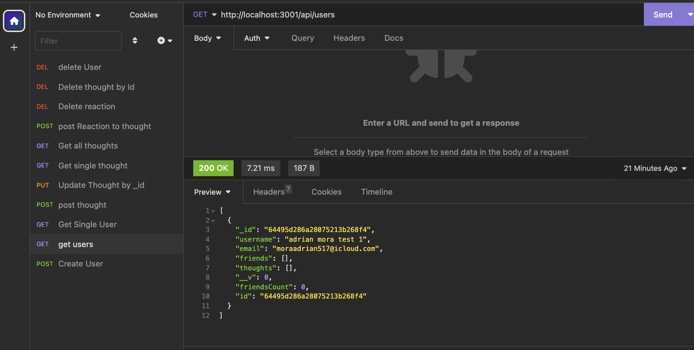

 
 

    
    
    
    
    
     
      

## Table of Contents

- [Overview](#overview)
- [Built With](#built-with)
- [License](#license)
- [Features](#features)
- [installation](#installation)
- [Contact](#contact)
- [Acknowledgements](#acknowledgements)

## Overview

***GIVEN*** a social network API
 
 
WHEN I enter the command to invoke the application
 
 

***THEN*** my server is started and the Mongoose models are synced to the MongoDB database
 
 
WHEN I open API GET routes in Insomnia for users and thoughts
 
 

***THEN*** the data for each of these routes is displayed in a formatted JSON
 
 

***WHEN*** I test API POST, PUT, and DELETE routes in Insomnia
THEN I am able to successfully create, update, and delete users and thoughts in my database
 
 

***WHEN*** I test API POST and DELETE routes in Insomnia
THEN I am able to successfully create and delete reactions to thoughts and add and remove friends to a user’s friend list

 

***Click Here***:
[Populist Video Walkthrough!!](https://drive.google.com/file/d/1kEcgbwlVQHbluz5JMNP0XFJ5tq83_m1g/view)

 
 

## Built With

1.  JS-BLACK-logo.png"  width="25" height="20">   [nodeJS](https://nodejs.org/en/docs/)

2.     [Mongoose](ttps://mongoosejs.com)

3.     [MongoDB](https://www.mongodb.com/)

4.      [JavaScript](https://devdocs.io/javascript/)

5.    [Express](https://expressjs.com/)

6.    [Moment.js](https://momentjs.com/)

## License

 

Copyright © 2007 Free Software Foundation, Inc. <https://fsf.org/>

Everyone is permitted to copy and distribute verbatim copies of this license document, but changing it is not allowed.

## Features

<u>***populist***</U> uses the tech mentioned in [Built With](#built-with), and use MangoDb to store data we insert in to insomnia and uses Mongoose framework to structure the schemas.

***Click Here***:
[Populist Video Walkthrough!!](https://drive.google.com/file/d/1kEcgbwlVQHbluz5JMNP0XFJ5tq83_m1g/view)

## Contact

If you would like to contribute or have any questions , please contact us through <u>**GitHub**</u>:

 [GitHub](https://github.com/moraadrian510)

 [Email](mailto:moraadrian510@icloud.com)

**Thank You for your feedback!!**

---

